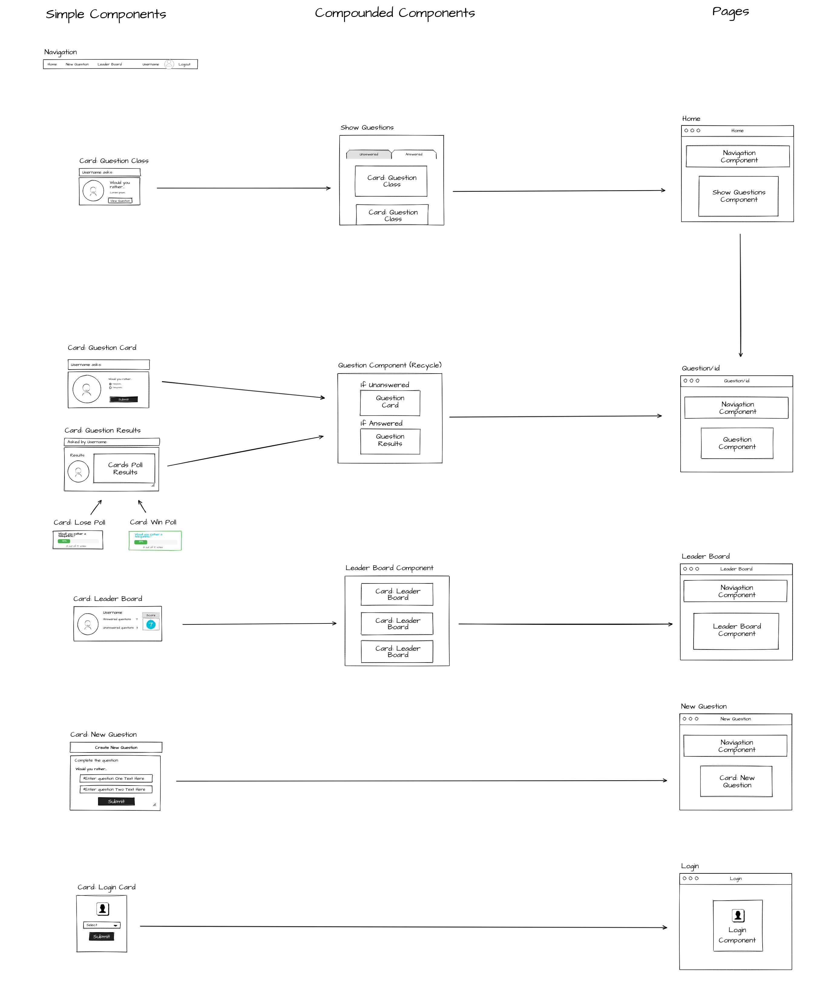
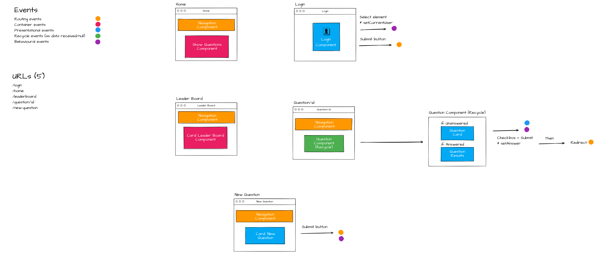
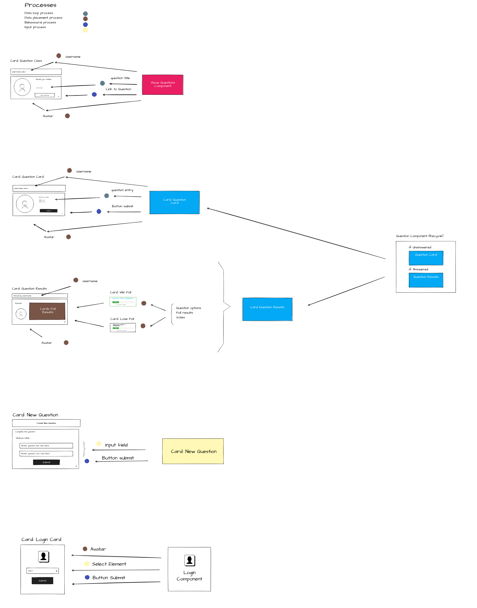

# Template for Building React/ Redux Projects

Planning out your app is imperative to success.

Sample Project [Video][4]

Project [Rubric][5]

* 404 Error Page
    1. [x] and shows a 404 page if that poll does not exist. 
    2. [x] new polls not accessible by url showing a 404 page

* log in & log out
    1. [x] Not logged in Users are not allowed to see poll/results
    2. [x] The application asks the user to sign in 
    3. [x] if !store:authedUser return Redirect to Component (react-router-dom)...

* Show Questions Component
    1. [x] answered/unanswered available at the root (`/`).
    2. [x] The user can alternate between answered/unanswered.
    3. [x] The unanswered questions are shown by default.
    4. [x] Question in correct category (answered/Unanswered)
    5. [x] An answered question links its details.
    6. [x] Order is from recent to old.
 
* Questions Component
    1. [x] poll details at `questions/:question_id`
    2. [x] unanswered/answered polls on the home page
   
    3. [x] Card Component
          1. [x] Unanswered, the following is shown:
             1. [x] the text “Would You Rather”
             2. [x] the avatar of the user
             3. [x] the two options.

          2. [x] Answered, the following is shown:
             1. [x] The option selected should be clearly marked.
             2. [x] the number of people who voted for that option;
             3. [x] the percentage of votes for that option.
   
    4. [ ] Upon voting:
          1. [x] The user’s response is recorded
          2. [x] the question appears in the “Answered” column.

* New Question Component
    1. [x] The form is available at `/add`.
    2. [x] shows “Would You Rather” and a form for two options.
    3. [x] Upon submitting the user is taken to home page.
    4. [x] The new question appears in unanswered questions.

* Leader Board Component
    1. [x] The Leaderboard is available at `/leaderboard`
    2. [x] Each entry on the leaderboard contains the following:
          1. [x] the user’s name
          2. [x] the user’s picture
          3. [x] the number of questions the user asked
          4. [x] the number of questions the user answered.
    3. [x] descending order based on sum of questions answered/asked.

* Navigation
    1. [x] The name of the logged in user is visible on the page.
    2. [x] The user can navigate to the leaderboard.
    3. [x] The user can navigate to the form to create a new poll.
    4. [x] The app contains a navigation visible in all pages.
    5. [x] navigation between new/polls, leaderboard and home.

* Architecture Spec
    1. [x] inputs and controlled components may have state.

# How to run

`npm install && npm start`

## Planning Stage

* Step 1 - Draw All of the Views of the App
* Step 2 - Break Each View Into a Hierarchy of Components
* Step 3 - Determine What Events Happen in the App
* Step 4 - Determine What Data Lives in the Store

## Coding Stage

* Step 1 - Design the [shape of the state][1] and [create reducers][2].
* Step 2 - Create a Redux store. Connect logger middleware (optional) and Redux Thunk middleware.
* Step 3 - For each view that needs access to the store, create the component and connect it to the store.
* Step 4 - For the component you created in the last step, create actions and action creators. Check that everything works correctly.
* Step 5 - Repeat Step 3 & Step 4 for each component that needs access to the store.
* Step 6 - Create presentational components and confirm that everything works correctly.
* Step 7 - Add React Router.
* Step 8 - Add finishing touches and make sure the project meets the [rubric][3].

## Action Plan

* Phase A: download data (Container events)
    * Step 1 - [Connect Store & Loading data](readme-assets/connect-store.md)
    * Step 2 - [Download & render data](readme-assets/load-render.md)

* Phase B: upload data (Presentational events)
    * Step 1 - Event handlers=> console.log
    * Step 2 - [Replace console.log by dispatch (actions)](readme-assets/replace-consolelog-by-dispatch.md)

### Hierarchy of Components

### Events Happen

### Data Lives

## @NOTES:

### Step 2 - ~~Download &~~ render data

After certain point, this is when the app is connected, the containers receives the data to pas it into their children and Presentational components place the data correctly.

To go further, it's needed to develop the login process, this is _to set a user on who base the dowloaded data_ as unanswered/answered questions, create/responses questions, and protected/redirect routes for un-authenticated users.

[1]: https://redux.js.org/usage/structuring-reducers/normalizing-state-shape
[2]: https://redux.js.org/tutorials/fundamentals/part-3-state-actions-reducers
[3]: https://review.udacity.com/#!/rubrics/1567/view
[4]: https://learn.udacity.com/nanodegrees/nd019/parts/87b7741f-aace-4bc9-88f4-7feccbb6eacb/lessons/996c5cf6-3220-42f5-a780-3ab2752f2fb2/concepts/d0b35860-eabe-414e-80bb-bfc0edeab6fe
[5]: https://review.udacity.com/#!/rubrics/1567/view